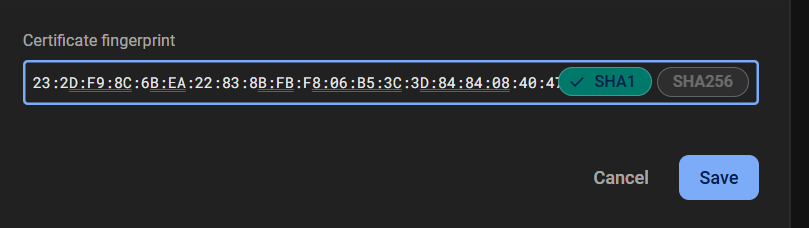

# Google Sign In
1. Paste this to your cmd "keytool -list -v \
-alias androiddebugkey -keystore %USERPROFILE%\.android\debug.keystore" in cmd 
2. Type password: "android"
3. Receive SHA1 and SHA256
4. Add Fingerprint in firebase
 
5. Paste "flutter pub add google_sign_in firebase_auth provider font_awesome_flutter cupertino_icons" in cmd